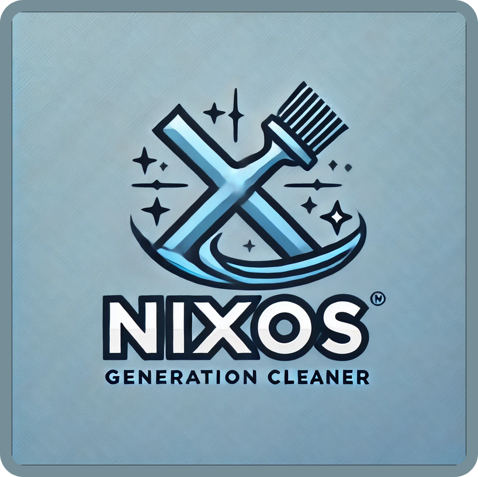

<p align = "left">
  
</p>

# NixOS Generation Cleaner

This Python application provides a graphical user interface (GUI) for managing and cleaning old generations of the NixOS operating system. With a simple click, users can remove previous generations to free up disk space while keeping the current system generation intact.

## Features

- User-friendly GUI to view and delete old NixOS generations.
- Password protection: Each user must authenticate using an admin password stored locally in "rootpassword" file.
- Clean up old system generations with ease to optimize system storage.

### Prerequisites

- Python 3.11 or higher.
- NixOS installed on the machine.

## Steps

#### 1. Clone the repository:

   ```bash
   git clone https://github.com/Zaque-69/Nixgen.git
   cd Nixgen-main
   ```

#### 2. Installation
  ```bash
  pip install -r requirements.txt
  ```
#### 3. Write the root password in the "rootpassword" file !

#### 4. Run the application
  ```bash
  python main.py
  ```

## Picture

<p align = "left">
  
</p>
